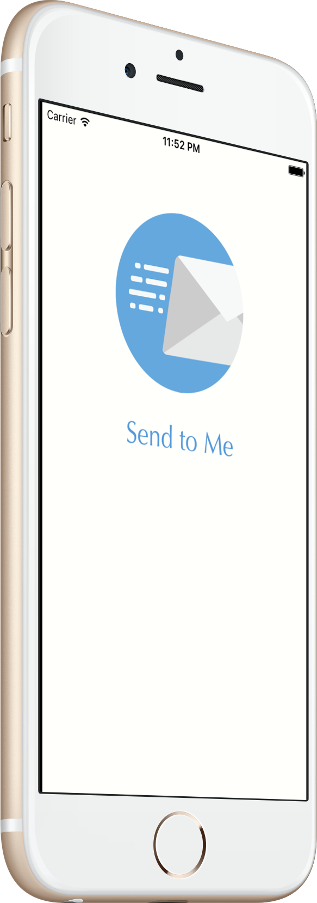

[](https://travis-ci.org/PiXeL16/SendToMe/) [](https://codecov.io/github/PiXeL16/SendToMe?branch=master) [](https://raw.githubusercontent.com/PiXeL16/SendToMe/master/LICENSE)
[](https://twitter.com/intent/tweet?text=Wow:&url=%5Bobject%20Object%5D)

# Send To Me
Share content to your email with a single tap.

`Send to Me` let you easily share content with your email with a `Share Extension`

[](https://geo.itunes.apple.com/us/app/send-to-me-send-content-to/id1100027787?mt=8)

## Why?
I personally use my email to handle my `TODO`. If I find something interesting that I want to read later, I send an email about it. It goes into my `TODO` for the next day and I read it.
For me, also, something in my email has more presence that something in a random app that I don't open as much.

Yes I know that there is such things like `Pocket` or `Safari Reading List` but I don't use them for reasons...(Like for example that I don't use `Safari` as my main browser at my computer).




## Requirements
* iOS 9.0+
* XCode 7.2+
* A [Mandrill](https://mandrillapp.com) API Key for sending the emails

## Instalation
After you clone the repo, just run :
```
pod install
```
It will install the dependencies and also ask for two keys

* Mandrill API Key: Its the API key of the MandrillAPI used to send the email

* From Email Address: Its the address that the email will be coming from, the address its normally setup in the Mandrill Website

## Screenshots


## Pods used
* [IBAnimatable](https://github.com/JakeLin/IBAnimatable)
* [LogKit](https://cocoapods.org/pods/LogKit)
* [IQKeyboardManagerSwift](https://github.com/hackiftekhar/IQKeyboardManager)
* [SwiftMandrill](https://github.com/PiXeL16/SwiftMandrill)
* [SwiftDelayer](https://github.com/PiXeL16/SwiftDelayer)
* [Quick & Nimble](https://github.com/Quick/Nimble)

## TODO
* Improve extension unit test(Apple does not have unit testing for extensions yet...)

## Author
Chris Jimenez - http://chrisjimenez.net, [@chrisjimeneznat](http://twitter.com/chrisjimeneznat)
